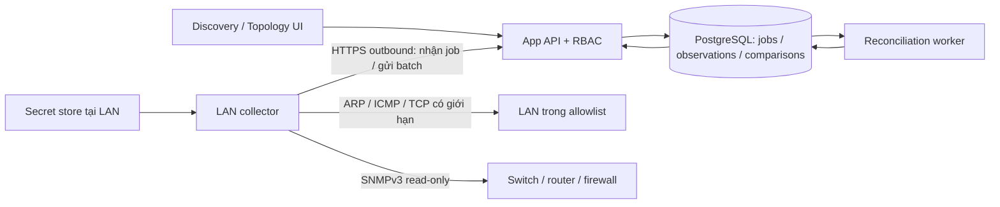

# PLAN-SC181-002 — Tự động phát hiện thiết bị LAN và đối chiếu Network Topology

**Hệ thống:** PACE Smart Campus 181 Network Digital Twin  
**Ngày lập:** 25/09/2026  
**Trạng thái:** Kế hoạch đề xuất; chưa triển khai collector hoặc quét LAN thực tế  
**Nguồn:** SOP-SC181-001, PLAN-SC181-001, integrated roadmap và mã nguồn hiện tại

## 1. Mục tiêu và kết quả người dùng nhận được

Cho phép chọn một Scenario thiết kế, chọn phạm vi LAN, chạy discovery hoặc đặt lịch tự động, sau đó trả lời:

1. Bao nhiêu thiết bị trong bản thiết kế đã được nhận diện ngoài thực tế?
2. Bao nhiêu kết nối đang đúng thiết bị và đúng cổng như thiết kế?
3. Thiết bị/kết nối nào khác thiết kế, phát sinh thêm hoặc chưa đủ dữ liệu xác minh?
4. Tỷ lệ matching là bao nhiêu, tính trên mẫu số nào, tại thời điểm nào?

Màn hình kết quả phải có phần trăm, số lượng tuyệt đối, phạm vi, thời gian và độ phủ dữ liệu. Ví dụ: “Thiết bị khớp 80% (40/50); kết nối khớp 75% (30/40); 5 kết nối chưa đủ dữ liệu”. Đây là ví dụ minh họa, không phải kết quả LAN PACE.

## 2. Hiện trạng và điểm tích hợp

Đối chiếu repository ngày lập kế hoạch:

| Thành phần hiện có | Tái sử dụng / phần cần bổ sung |
|---|---|
| `DeviceInstance`: hostname, serialNumber, managementIp, model, location, scenarioId | Là inventory thiết kế; bổ sung định danh MAC/chassis qua bảng riêng, hỗ trợ nhiều giá trị |
| `Port`, `PhysicalLink` | Là graph thiết kế theo cổng; bổ sung mapping interface thực tế sang Port |
| `LagGroup`, `Vlan`, `Subnet`, `VlanMembership` | Dùng cho đối chiếu cấu hình ở giai đoạn sau |
| `topologyService.ts`, `topologyRepository.ts` | Dùng đọc topology; cần snapshot nhất quán trong transaction khi bắt đầu comparison |
| `src/components/topology/topology-canvas.tsx` | Điểm tích hợp lớp hiển thị thiết kế/thực tế/sai lệch |
| Scenario clone/compare, AuditLog | Tái sử dụng nguyên tắc isolation, versioning, audit; comparison discovery là loại dữ liệu riêng |
| PDF worker và PostgreSQL | Tham khảo cách tách worker; discovery có job/worker riêng, không ghép vào PDF worker |

Chưa có module LAN discovery, collector, observation hoặc reconciliation trong các thành phần đã kiểm tra. Roadmap tích hợp ghi M1–M5 đã hoàn tất; kế hoạch này dựa trên code và roadmap đó, không dựa vào trạng thái M1 cũ ở đầu PLAN-SC181-001.

SOP-001 chưa yêu cầu SNMP realtime ở phase đầu và cấm lưu password thiết bị production. Đây là phần mở rộng đọc dữ liệu theo đợt; credential thiết bị nằm tại collector/secret store của đơn vị vận hành, ứng dụng chỉ giữ mã tham chiếu. Không tự động cấu hình thiết bị hay ghi đè Scenario.

## 3. Phạm vi triển khai

### MVP: discovery + đối chiếu thiết bị và physical link

- Collector Linux đặt trong LAN, bắt đầu bằng một management VLAN và một VLAN người dùng thí điểm.
- IPv4 CIDR được cấu hình rõ ràng; kết hợp ARP cùng broadcast domain, ICMP/TCP discovery theo profile và SNMPv3 đọc inventory/interface/LLDP.
- Đọc thiết bị quản lý trong danh sách seed ngay cả khi chúng không trả lời ping.
- Tự động chuẩn hóa/deduplicate observations, đề xuất mapping, tự chấp nhận mapping đủ chắc chắn, cho phép xác nhận thủ công trường hợp còn mơ hồ.
- Phát hiện physical link bằng LLDP và mapping cổng; báo mức chứng cứ cho từng kết nối.
- Scan thủ công, lịch định kỳ, lịch sử, hủy scan, báo lỗi một phần; comparison theo scope và Scenario snapshot.
- Dashboard matching, danh sách sai lệch, overlay Topology, xuất CSV/JSON có công thức và phiên bản thuật toán.

### Giai đoạn tiếp theo

- CDP/vendor adapters, DHCP lease/controller API, ARP/FDB từ switch để mở rộng endpoint discovery.
- So sánh VLAN access/trunk/native, LAG, tốc độ negotiated và IP plan khi có nguồn dữ liệu đủ tin cậy.
- IPv6 qua nguồn địa chỉ đã biết/ND thích hợp; không quét vét cạn một subnet `/64`.
- Multi-campus/VRF, cảnh báo drift và lịch bảo trì; đồng bộ có review vào Scenario clone.

MVP không cam kết phát hiện 100% thiết bị đang tồn tại: thiết bị tắt/ngủ, bị ACL chặn, unmanaged switch, client Wi-Fi và MAC ngẫu nhiên có thể thiếu hoặc mơ hồ. Không suy ra vị trí tầng từ IP đơn thuần; dùng mapping thiết kế đã xác nhận. Camera/AP chỉ được xác định model chính xác nếu có chứng cứ phù hợp, không chỉ từ hãng MAC.

## 4. Kiến trúc đề xuất

- Browser điều khiển job và xem kết quả. Collector thực hiện giao tiếp LAN; không chạy scan trong HTTP request của Next.js.
- Collector chủ động kết nối HTTPS ra app, không cần mở cổng điều khiển inbound từ Internet vào LAN; không truy cập trực tiếp database ứng dụng.
- Baseline: collector Node.js/TypeScript để dùng chung schema payload, gọi công cụ discovery bằng argv cố định; chọn thư viện SNMP sau PoC tương thích thiết bị và license review. Nmap host discovery là ứng viên, chưa chốt đóng gói/phân phối trước khi kiểm tra license.
- Worker reconciliation riêng, queue dựa trên PostgreSQL để giữ ít thành phần vận hành. Claim bằng lease, heartbeat, retry hữu hạn, idempotency key và fencing token để loại kết quả từ worker/collector hết lease.
- Mỗi scan có deadline, giới hạn concurrency/rate/targets và trạng thái `QUEUED/RUNNING/SUCCEEDED/PARTIAL/FAILED/CANCELLED`. Có lỗi credential hoặc timeout nguồn quan trọng thì không báo SUCCEEDED toàn phần.
- Batch ingestion unique theo `(collectorId, runId, batchId)`; finalize bằng manifest/checksum. Chỉ comparison snapshot dữ liệu đã finalize; scan PARTIAL vẫn so sánh được nhưng phải mang trạng thái thiếu chứng cứ.
- Schedule không tạo hai job chồng nhau cùng scope; missed schedule gộp một lần chạy, không chạy bù hàng loạt. Collector offline phải hiện rõ, không biến thành toàn bộ thiết bị offline.

### Giới hạn quan sát cần thể hiện trong sản phẩm

ARP chỉ quan sát trực tiếp cùng miền L2; subnet khác cần route/ACL cho probe hoặc collector ở miền tương ứng. Nmap mô tả riêng hành vi ARP với Ethernet cục bộ trong [tài liệu host discovery](https://nmap.org/book/man-host-discovery.html).

LLDP cung cấp định danh chassis và port của láng giềng; dùng dữ liệu này làm nguồn adjacency, sau đó ánh xạ sang inventory và Port. Xem [tài liệu LLDP của Cisco](https://www.cisco.com/c/en/us/support/docs/smb/switches/cisco-250-series-smart-switches/smb5488-manage-the-link-layer-discovery-protocol-lldp-neighbor-infor.html). Collector đọc bảng neighbor từ thiết bị quản lý; không giả định chỉ lắng nghe LLDP tại một máy là thấy cả campus.

SNMPv3 có mô hình xác thực và bảo vệ thông điệp được mô tả trong [RFC 3414](https://www.rfc-editor.org/info/rfc3414/). Profile triển khai ưu tiên `authPriv`; thuật toán cụ thể phải kiểm tra khả năng thiết bị, không tự hạ cấp sang v2c khi thất bại.

## 5. Pipeline thu thập và chuẩn hóa

1. **Preflight:** xác minh collector heartbeat, phiên bản adapter, interface/route, scope allowlist và nguồn credential. Chụp snapshot thiết kế và scope filter dùng cho comparison.
2. **Host discovery:** phát hiện IP đang phản hồi; lưu protocol và thời điểm. Ping thất bại không đủ kết luận thiết bị không tồn tại.
3. **Managed inventory:** đọc system identity, serial/model nếu có, interface name/alias/MAC/admin/operational/speed, LLDP neighbors. Mỗi adapter công bố capability và lỗi riêng cho từng bảng.
4. **Endpoint enrichment:** ở phase sau, ghép ARP/FDB/DHCP/controller; bản ghi cache có tuổi dữ liệu, không đồng nghĩa thiết bị đang online. Nhiều MAC sau một port uplink không chứng minh các máy cắm trực tiếp vào port đó.
5. **Normalize:** chuẩn hóa MAC, IP, hostname và port alias theo vendor; giữ raw value/source. `ifIndex` chỉ là định danh trong lần quan sát, không coi ổn định qua reboot.
6. **Identity resolution:** gộp nhiều NIC/IP về một thiết bị khi có bằng chứng; không gộp chỉ vì cùng hostname hoặc cùng IP ở các VRF khác nhau.
7. **Reconcile:** ghép thiết bị một-một, ghép port, so sánh graph, tạo finding và score. Thiếu dữ liệu giữ UNKNOWN.
8. **Publish:** đóng băng comparison và evidence; scan mới hoặc quyết định mapping mới tạo comparison mới, không sửa báo cáo cũ.

Profile thí điểm đề xuất: tối đa 1.024 IPv4/run, 32 host probes đồng thời, tối đa 50 probe/giây, 4 SNMP sessions đồng thời, timeout request 2 giây, retry 1 lần, deadline run 15 phút. Đây là giá trị khởi đầu để đo tải, không phải cam kết hiệu năng; điều chỉnh ở ND-0. Chu kỳ đề xuất 60 phút; freshness mặc định 2 chu kỳ. LLDP expiry vẫn tuân theo TTL nguồn nếu ngắn hơn, không kéo dài bằng freshness chung.

## 6. Thiết kế dữ liệu bổ sung

Các tên sau là contract đề xuất, chưa phải migration đã tồn tại:

| Entity | Nội dung / invariant chính |
|---|---|
| `DiscoveryCollector` | campus/site, fingerprint/token reference, capabilities, heartbeat, status |
| `DiscoveryScope` | campus, network-domain/VRF, CIDR allowlist/exclusions, seed devices, profile, schedule, credentialRef; versioned |
| `DiscoveryRun` | scope version, collector, lease, manifest, timestamps, status và source coverage |
| `ObservedDevice` | run, local observation ID, identity candidates, source, seenAt, freshness, collection errors |
| `ObservedInterface` | observed device, ifIndex/ifName/ifAlias/MAC, speed/status và evidence |
| `ObservedLink` | endpoints/ports khi biết, direction, source, TTL, evidence level; có thể unresolved |
| `DeviceIdentity` | `(scenarioId, deviceId, kind, normalizedValue, namespace)`; serial/MAC/chassis ID, provenance; không ép mọi MAC shared thành unique toàn cục |
| `DiscoveryMapping` | scenario, observed stable identity → device/port, AUTO/MANUAL, confidence, actor/reason, validity; một-một trong comparison |
| `DesignSnapshot` | immutable JSON thiết bị/ports/links đủ để tái lập, content hash, scope selection và capturedAt |
| `ReconciliationRun` | observation run + design snapshot + mapping version + algorithm/config version, counts, scores, coverage |
| `ReconciliationFinding` | entity keys, MATCHED/DRIFT/NOT_OBSERVED/UNKNOWN/AMBIGUOUS/EXTRA, expected/observed, evidenceRefs |

Observations thuộc site/network-domain và lần scan, không thuộc Scenario thiết kế; cùng scan có thể so nhiều Scenario. Mapping và comparison phải giới hạn đúng Scenario, composite FK khi tham chiếu device/port. Không clone observations khi clone Scenario; mapping copy chỉ là gợi ý cần kiểm tra lại.

Chụp thiết kế bằng transaction nhất quán, không chỉ dùng `Scenario.updatedAt` vì sửa child record có thể không cập nhật field đó. Việc thay đổi bản thiết kế sau khi scan bắt đầu không thay đổi mẫu số của báo cáo đã tạo. Thiết bị ảo, generic planning node, thiết bị loại trừ và link dự kiến chưa triển khai phải có inclusion policy được ghi vào snapshot; UI hiện số bị loại và lý do.

Retention đề xuất: raw evidence 30 ngày, observations 90 ngày, comparison summary/snapshot 12 tháng; chốt sau khi đo dung lượng. Redact secrets trước ingestion, giới hạn kích thước raw payload, không thu thập running-config hoặc packet payload. Khi evidence hết hạn, báo rõ chi tiết không còn; giữ normalized inputs cần tái lập score theo retention comparison.

## 7. Quy tắc matching thiết bị và kết nối

### 7.1 Định danh thiết bị

| Bằng chứng | Điểm tin cậy đề xuất | Cách xử lý |
|---|---:|---|
| Mapping thủ công còn hợp lệ, không có strong identity conflict | 100 | Chấp nhận, ghi người xác nhận |
| Serial chính xác + vendor namespace, unique ở hai phía | 100 | Tự ghép nếu không có mâu thuẫn |
| MAC/chassis identity ổn định đã xác nhận, unique ở hai phía | 95 | Tự ghép; loại virtual/shared/randomized MAC |
| Management IP + hostname đều trùng | 80 | Gợi ý review trong MVP |
| Chỉ IP hoặc chỉ hostname trùng | 50 | Không tự ghép |
| Chỉ hãng/model/type tương tự | 20 | Gợi ý, không tính MATCHED |

Đây là điểm rule-based để xếp hạng, không phải xác suất thống kê. Không cộng dồn chứng cứ tương quan để vượt ngưỡng. Ngưỡng AUTO ban đầu ≥95, bắt buộc unique candidate và không có xung đột strong identity; nhiều ứng viên hoặc serial khác nhau chuyển AMBIGUOUS dù IP/hostname trùng. Matching toàn bộ tập phải giữ một-một, không dùng greedy first-match gây trùng thiết bị.

Phân biệt **identity match** và **configuration conformity**: thiết bị có serial đúng nhưng đổi IP vẫn được tính thiết bị đã nhận diện; tạo finding IP_DRIFT riêng. Model chưa biết không kết luận MODEL_MISMATCH. Thay thiết bị cùng IP nhưng serial khác phải yêu cầu remap.

### 7.2 Physical link

- Chỉ xét link sau khi hai thiết bị đã ghép và hai interface đã ánh xạ sang Port thiết kế.
- Khóa link là cặp endpoint `(device, port)` được sắp thứ tự; A→B và B→A là một physical link.
- Đề xuất ba cấp evidence: `CONFIRMED` khi LLDP hai phía nhất quán còn hạn; `SUPPORTED` khi một phía chỉ rõ hai endpoint/port và không có mâu thuẫn; `INFERRED` khi chỉ suy ra từ FDB/ARP.
- MVP chỉ tính `CONFIRMED` vào link MATCHED chính thức. SUPPORTED hiện riêng để người dùng review; quyết định thủ công được audit và tạo comparison mới. INFERRED không được tính như dây vật lý đã xác minh.
- Đúng hai thiết bị nhưng sai cổng: PORT_DRIFT. Đúng cổng nhưng sai tốc độ: link connectivity vẫn matched, SPEED_DRIFT thuộc configuration conformity.
- Không có LLDP/capability/port mapping: UNKNOWN. Thiếu neighbor chỉ báo NOT_OBSERVED khi collection đầy đủ và nguồn đã qua kiểm tra freshness; vẫn không đồng nghĩa chắc chắn cáp bị tháo.
- LAG so theo member physical link trong MVP; không đếm thêm logical bundle như một physical link. HA/stack/MLAG cần adapter/policy riêng; chưa resolve thì UNKNOWN.

## 8. Công thức phần trăm và cách tránh hiểu sai

### 8.1 Tập so sánh cố định

`D` là số thiết bị thiết kế trong scope; `L` là số physical link thiết kế trong scope. Chốt scope trước khi scan, không loại thiết bị khỏi mẫu số chỉ vì scan không thấy. Chọn theo site/floor/device class và deployment intent; CIDR là phạm vi thu thập, không phải lý do âm thầm bỏ thiết bị chưa có IP. Cross-floor/uplink đi qua ranh giới được liệt kê và gán inclusion policy rõ ràng, kéo thêm endpoint phụ trợ khi cần thu thập.

Mỗi entity thiết kế có một trạng thái đối chiếu chính; configuration findings tách riêng. `EXTRA` thuộc tập quan sát, không cộng vào D/L. Mỗi báo cáo hiển thị cả số UNKNOWN, NOT_OBSERVED, AMBIGUOUS và phần bị loại khỏi scope.

### 8.2 KPI bắt buộc

| KPI | Công thức | Ý nghĩa |
|---|---|---|
| Device match | `100 × Md / D` | Md: thiết bị có identity mapping được chấp nhận và evidence hiện hành |
| Link match | `100 × Ml / L` | Ml: physical link đúng endpoint/port, được xác minh theo policy |
| Evidence coverage | `100 × E / N` cho từng loại | E: entity đủ chứng cứ để đưa ra kết luận; N: D hoặc L; bao gồm kết luận không khớp |
| Match trên phần đã xác minh | `100 × M / E` | KPI phụ, luôn hiển thị cùng coverage; không thay cho match toàn scope |
| Extra observed | Số thiết bị/link hiện hành ngoài thiết kế | Loại ambiguous/unresolved sang nhóm riêng; không gọi mọi quan sát chưa map là EXTRA chắc chắn |

Mẫu số bằng 0 trả `N/A`, không trả 100%. Thu thập thành công một subnet không tự động có nghĩa coverage 100%; evidence coverage xét từng entity và khả năng quan sát định danh/link. UNKNOWN và AMBIGUOUS không thuộc E. NOT_OBSERVED chỉ thuộc E khi đã đủ chứng cứ phạm vi/nguồn theo rule, và vẫn mang ý nghĩa “không quan sát thấy”.

**Điểm tổng hợp đề xuất:** `S = 0,5 × DeviceMatch + 0,5 × LinkMatch`, chỉ khi D và L đều >0. Đây là trọng số sản phẩm cần chốt ở ND-0, không phải tiêu chuẩn mạng. Không tự đổi trọng số khi thiếu link; khi không áp dụng một thành phần, tổng hợp là N/A và chỉ hiển thị KPI thành phần. Khi coverage dưới 90% ở bất kỳ thành phần nào, gắn nhãn “Tạm tính — thiếu chứng cứ”; scan FAILED/CANCELLED không phát hành score chính thức.

Ví dụ: D=50, Md=40, Ed=45; L=40, Ml=30, El=35. Device match=80%, link match=75%, tổng hợp=77,5%; coverage thiết bị=90%, link=87,5%, nên tổng hợp là tạm tính. Match trên phần đã xác minh lần lượt 88,9% và 85,7%. Nếu có 3 thiết bị ngoài thiết kế, hiển thị `Extra devices: 3` bên cạnh; không giấu trong điểm trung bình.

Điểm match đo mức hiện thực hóa thiết kế, không bảo đảm mạng không có thiết bị thừa. Chỉ gắn nhãn **“Khớp hoàn toàn”** khi cả hai match và coverage đều 100%, không EXTRA/AMBIGUOUS/UNKNOWN và không drift ở các thuộc tính bắt buộc của profile. Configuration conformity cho VLAN/LAG/speed sẽ là KPI riêng ở phase sau, không âm thầm đổi công thức MVP.

## 9. Luồng UI và API dự kiến

1. **Discovery setup:** chọn collector, CIDR/seed, loại trừ, profile và credential reference; kiểm tra connectivity.
2. **Chọn thiết kế:** Scenario + phạm vi + inclusion policy; preview mẫu số thiết bị/link và phần ngoài scope.
3. **Scan:** hiển thị tiến độ theo bước, số host/managed device, lỗi nguồn, thời gian; hỗ trợ cancel.
4. **Mapping review:** expected/observed cạnh nhau, confidence, chứng cứ, lý do conflict; confirm/reject có audit.
5. **Results:** KPI + coverage + thời gian; filter matched/drift/unknown/extra; click finding để focus device/link trong Topology.
6. **Topology overlay:** switch Thiết kế / Quan sát / Đối chiếu; dùng icon/line style và legend cùng màu. Quan sát chưa có vị trí nằm trong vùng “Chưa xác định vị trí”, không tự gán tầng.
7. **History/export:** so hai lần chạy cùng scope/profile/snapshot hoặc cảnh báo không so trực tiếp được; xuất kèm algorithmVersion và denominator.

| API dự kiến | Vai trò |
|---|---|
| `GET/POST /api/discovery/scopes` | Xem/tạo scope; sửa bằng resource endpoint có version check |
| `POST /api/discovery/runs` | Tạo job idempotent, trả 202 + runId |
| `GET /api/discovery/runs/:id` | Tiến độ, source coverage, lỗi |
| `POST /api/discovery/runs/:id/cancel` | Hủy best-effort; collector dừng giữa các batch |
| `POST /api/discovery/collector/claim` | Collector nhận job có lease |
| `POST /api/discovery/collector/heartbeat` | Gia hạn lease và báo sức khỏe |
| `POST /api/discovery/collector/batches` | Ingest observations đã validate |
| `POST /api/discovery/collector/finalize` | Kiểm tra manifest và đóng scan |
| `POST /api/scenarios/:id/reconciliations` | So scan với snapshot thiết kế đã chọn |
| `GET /api/scenarios/:id/reconciliations/:comparisonId` | KPI, finding, evidence; phân trang dữ liệu lớn |
| `POST /api/scenarios/:id/discovery-mappings` | Confirm/reject mapping và tạo version mới |

Giữ Route → Service → Repository. Module dự kiến: `src/server/services/discoveryService.ts`, `reconciliationService.ts`, repository tương ứng, domain matching/scoring thuần TypeScript, `src/workers/reconciliationWorker.ts`, `src/collectors/lan/`, `src/components/discovery/`. Đọc tài liệu Next.js cục bộ tại `node_modules/next/dist/docs/` trước khi viết route/UI; tài liệu này chưa thay đổi code Next.js.

## 10. Quyền truy cập và vận hành

- ADMIN quản lý collector/scope/schedule; ADMIN hoặc EDITOR được cấp quyền discovery mới chạy scan và xác nhận mapping; VIEWER chỉ đọc. Collector dùng danh tính máy riêng, chỉ nhận job và gửi dữ liệu đúng site/scope.
- Xác thực/RBAC thực phải là dependency trước pilot LAN production; kiểm tra cơ chế hiện tại ở ND-0, không dùng actorId do browser gửi làm căn cứ phân quyền.
- App và collector đều validate scope. Không nhận arbitrary shell/flags/OID từ browser; chống command injection, CIDR vượt allowlist, địa chỉ loopback/link-local/metadata không được cấp scope. Không tự động mở rộng scan theo IP do neighbor quảng bá.
- SNMP read-only, credential không đi qua browser/database/log ứng dụng; rotate collector token, kiểm tra TLS và chống replay bằng lease/run/batch identity.
- Ưu tiên collector service trên Linux; nếu dùng Docker, kiểm tra khả năng nhìn VLAN và cấp capability tối thiểu theo probe. Không mặc định `privileged: true` hoặc cho web container quyền raw socket.
- Theo dõi scan duration, probe volume, timeout/auth errors, queue age, ingestion rejection, coverage, matching ambiguity và collector heartbeat.
- Kill switch dừng lịch và job mới; rollback image collector/worker độc lập. Migration additive, không xóa dữ liệu thiết kế; rollback ứng dụng không xóa observations.

## 11. Milestone và backlog triển khai

Ước lượng sơ bộ cho một developer phối hợp một network admin, chưa gồm thời gian chờ thiết bị/quyền truy cập. MVP ND-0→ND-5 khoảng 20–30 ngày công, cần điều chỉnh sau PoC.

| Mốc | Công việc / đầu ra | Phụ thuộc | Ước lượng | Exit gate |
|---|---|---|---:|---|
| ND-0 — Khảo sát và contract | Ma trận VLAN/VRF/ACL, collector placement, capability theo model/firmware, identity completeness, ADR scope/score/secrets và fixture scrubbed | Inventory/Topology hiện có; network admin | 2–3 ngày | Có scope pilot, snapshot mẫu, quyết định KPI và adapter PoC |
| ND-1 — Data/job foundation | Migration additive, DTO/schema validation, queue lease, collector auth, RBAC, mock collector, snapshot transaction | ND-0 | 3–4 ngày | Duplicate/retry không nhân dữ liệu; cross-site/scenario bị chặn |
| ND-2 — LAN collector | Host discovery, SNMP identity/interfaces/LLDP, batch/finalize, rate limit/cancel, image/runbook | ND-1 | 4–6 ngày | Thu thập fixture lab và pilot có số liệu coverage; không lộ secrets |
| ND-3 — Reconciliation | Normalize, dedup, identity/port matching, graph diff, evidence rules, score và manual mapping | ND-1; fixtures ND-2 | 4–6 ngày | Golden dataset cho ra đúng counts/score/finding, tái lập được |
| ND-4 — UI/report | Setup/scan/history, mapping review, KPI/coverage, Topology overlay và CSV/JSON | ND-2/3 | 4–6 ngày | Hoàn thành luồng scan → review → matching report trong E2E |
| ND-5 — Pilot/handover | Lịch scan, load/failure test, staging release, UAT cùng admin, runbook/rollback | ND-4 + auth production | 3–5 ngày | Biên bản ground truth, giới hạn adapter và sai lệch được review |
| ND-6 — Mở rộng | FDB/DHCP/controller, vendor adapters, VLAN/LAG/IP conformity, cảnh báo drift | MVP được nghiệm thu | Ước lượng sau pilot | Có contract/fixture/coverage riêng cho từng nguồn |

PoC ND-0 phải kiểm tra tối thiểu thiết bị thực tế đại diện core/access/firewall và endpoint; danh sách catalog hiện có chỉ là đầu vào khảo sát, không bảo đảm firmware đang vận hành hỗ trợ cùng MIB. Không gắn VERIFIED cho adapter trước khi có evidence.

## 12. Acceptance và kiểm thử

| ID | Tình huống | Kết quả bắt buộc |
|---|---|---|
| AC-01 | 10 thiết bị, 8 link, tất cả mapping/evidence xác minh đúng | Device/link match=100%; coverage=100%; không drift |
| AC-02 | Cùng serial nhưng đổi IP | Identity vẫn matched, có IP_DRIFT |
| AC-03 | IP cũ bị thiết bị serial khác sử dụng | Không auto-match; conflict/review |
| AC-04 | Hostname trùng, nhiều NIC/IP, shared/virtual MAC | Không ghép nhầm, không đếm đôi; ambiguous giữ riêng |
| AC-05 | Link ngược chiều trong LLDP và parallel links khác port | Link hai chiều chỉ đếm một; parallel link giữ riêng |
| AC-06 | Đúng thiết bị nhưng cắm sai cổng | PORT_DRIFT, link đó không MATCHED |
| AC-07 | ICMP bị chặn nhưng SNMP đọc được; SNMP lỗi credentials | Trường hợp đầu vẫn nhận diện; trường hợp sau có lỗi nguồn/UNKNOWN |
| AC-08 | Thiếu LLDP, LLDP một chiều hoặc TTL hết hạn | Không báo link confirmed 100%; evidence level/coverage đúng |
| AC-09 | Scan thất bại một VLAN hoặc collector mất kết nối | PARTIAL/FAILED rõ ràng, không báo mọi thiết bị mất khỏi LAN |
| AC-10 | Thiết bị thừa, unmanaged switch/Wi-Fi/FDB sau uplink | EXTRA hoặc unresolved phù hợp; không tạo dây vật lý suy đoán |
| AC-11 | Snapshot rỗng hoặc không có link | KPI không áp dụng trả N/A; không chia 0, không tự báo 100% |
| AC-12 | Scan retry/batch trùng, lease hết hạn, cancel | Không nhân observations; từ chối stale lease; báo trạng thái nhất quán |
| AC-13 | Sửa thiết kế hoặc mapping khi scan đang chạy | Báo cáo cũ tái lập nguyên vẹn; lần đối chiếu mới có version mới |
| AC-14 | Cross-site/scenario, quyền VIEWER, payload quá lớn hoặc target ngoài scope | Bị từ chối; audit phù hợp và không có scan ngoài allowlist |
| AC-15 | Ví dụ D=50/Md=40/Ed=45; L=40/Ml=30/El=35 | 80%, 75%, 77,5% tạm tính; coverage 90%/87,5% |

Unit tests tập trung normalization, candidate conflict, graph diff và công thức; integration tests dùng PostgreSQL thật cho isolation/lease/idempotency/snapshot; E2E dùng mock collector deterministic. CI không quét LAN production. Lab dùng thiết bị hoặc simulator với fixture đã scrub, thêm timeout/packet loss và reboot thay ifIndex.

Pilot lập ground truth bằng inventory thực và kiểm tra switch ports cùng network admin. Đo riêng precision auto-match, recall discovery và link coverage; yêu cầu không có false auto-match trong tập nghiệm thu, nhưng ghi rõ cỡ mẫu, không tuyên bố chính xác tuyệt đối toàn mạng. Mục tiêu ban đầu discovery ≥95% thiết bị được xác nhận online và có giao thức được profile hỗ trợ trong scope lab; các thiết bị không quan sát được phải được báo riêng.

Trước release: lint, typecheck, unit/integration, build, migration trên DB sạch và DB nâng cấp, E2E, collector image check, thử restore/rollback và kill switch. Cập nhật README_DEV/CHANGELOG_DEV khi có implementation; kế hoạch hiện tại chỉ thêm tài liệu.

## 13. Thông tin cần thu thập khi bắt đầu ND-0

| Thông tin | Giả định để lập kế hoạch |
|---|---|
| CIDR/VLAN/VRF và subnet được phép scan | Chưa có dữ liệu thực; bắt đầu một management VLAN + một user VLAN |
| Collector host và đường tới app | Linux trong LAN, outbound HTTPS tới app |
| Credential/capability | Có thể cấp SNMPv3 read-only trên thiết bị pilot; không mặc định mọi thiết bị hỗ trợ |
| Scenario nghiệm thu và identity baseline | Chọn explicit; ưu tiên serial/MAC đã xác minh để tăng auto-match |
| Thiết bị bắt buộc trong scope | Core/access/firewall/AP/camera; PC/printer là nhóm bật thêm theo scope |
| Chu kỳ và tải cho phép | 60 phút, profile giới hạn tại mục 5, hiệu chỉnh sau đo |
| Trọng số và ngưỡng báo cáo | Device/link 50/50; coverage dưới 90% gắn tạm tính |

Các giả định này cho phép hoàn thiện thiết kế/mock trước; scope, route và quyền truy cập thực cần có trước khi chạy pilot. Bước implementation đầu tiên là ND-0 rồi ND-1; chưa chạy scan LAN trong công việc lập kế hoạch này.
