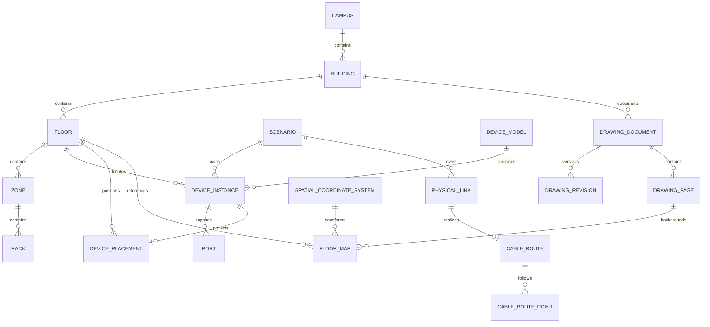

# SC181 integrated domain model

**Status:** M1 and SP-0 contracts implemented; spatial foundation migration is `20260811163000_sp0_spatial_foundation`
**Sources:** SOP-SC181-001 and SOP-SC181-002

## Domain ownership map

## M1 schema contract

M1 creates only the shared hierarchy/catalog and core scenario inventory required by SOP-001:

| Entity | Ownership | Required M1 invariants |
|---|---|---|
| Campus | Shared | Unique code |
| Building | Shared | Unique code within Campus |
| Floor | Shared | Unique code within Building; nullable `elevationMeters`, `floorToFloorHeightMeters` |
| Zone | Shared | Unique code within Floor |
| Rack | Shared | Unique code within Zone; positive rack units |
| Vendor | Shared | Unique code |
| DeviceModel | Shared | Unique SKU; evidence status/source fields |
| PortProfile | Shared | Unique ordered port group within model; positive count |
| Scenario | Scenario root | Type enum, parent reference, locked flag |
| DeviceInstance | Scenario | Unique hostname within Scenario; composite key `(id, scenarioId)`; authoritative location |
| Port | Scenario via Device | Unique name/index within DeviceInstance; generated from PortProfile |

No PDF, placement, cable-route or 3D tables are introduced in M1. Their foreign-key contracts are reserved by ADR-0002/0003 and implemented in SP-0.

## Cross-domain invariants implemented in SP-0

- Placement `(deviceInstanceId, scenarioId)` must reference DeviceInstance with the same scenario.
- Placement floor must match DeviceInstance floor.
- Scenario-specific FloorMap and BuildingModel3D overrides never duplicate source binary objects.
- CableRoute is scenario-owned; `physicalLinkId` is constrained to null until M2 can add its composite PhysicalLink foreign key.
- Canonical placement survives FloorMap revision and drawing deletion.
- RackPlacement locates a Rack; DeviceInstance remains authoritative for rack/U assignment.

## Entity phase register

| Phase | Entities/contracts |
|---|---|
| M1 | Campus, Building, Floor, Zone, Rack, Vendor, DeviceModel, PortProfile, Scenario, DeviceInstance, Port |
| M2 | PhysicalLink and topology persistence |
| SP-0 | DrawingDocument, DrawingPage, DrawingRevision, FloorMap, SpatialCoordinateSystem, ScaleCalibration, DevicePlacement, SpatialZone, BuildingFeature, DrawingImportJob, BuildingModel3D, ModelNodeMapping, CableRoute, CableRoutePoint, Riser |
| SP-2 | FloorLayerConfig and editor persistence |
| SP-3 | RackPlacement, CableRouteSegment and multi-floor/riser geometry |
| Later | ExtractedVectorPrimitive, coverage configs and ExternalModelReference |

## Items explicitly deferred

- confirmed building dimensions/elevations;
- PostGIS;
- RF or camera physics;
- OCR/AI extraction;
- PRC/U3D conversion;
- production object-storage vendor.
